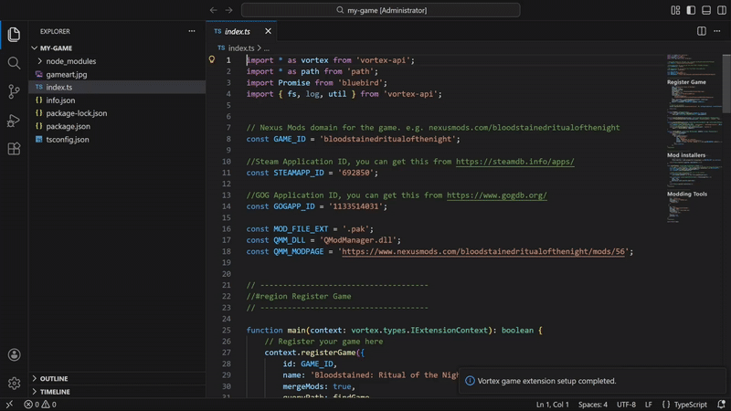
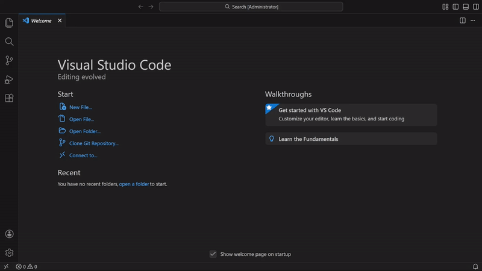
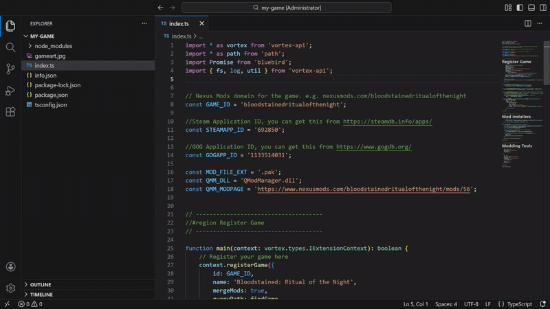

# Vortex Extension Helper

A Visual Studio Code extension that streamlines the development of game support extensions for [Vortex](https://www.nexusmods.com/about/vortex/).



## Features

### 🚀 Quick Project Scaffolding

- **New Game Extension Wizard**: Create a basic game support extension structure with a single command
- **Language Support**: Choose between JavaScript or TypeScript projects
- **Automatic Setup**: Generates all required files including `info.json`, package.json, `index.js/ts`, configuration files, and placeholder game artwork

### 💡 Intelligent Code Completion

- **Vortex API Snippets**: Access pre-built code snippets for common Vortex API patterns
- **Context-Aware**: Snippets include game registration, mod installers, mod manager integration, and tool definitions
- **Language-Specific**: Tailored completions for both JavaScript and TypeScript projects

### ✅ Workspace Validation

- **File Structure Checks**: Automatically validates that all required files are present
- **JSON Validation**: Ensures `info.json` and package.json contain required fields
- **Live Diagnostics**: Real-time validation as you edit files

### 📦 Dependency Management

- **Vortex API Installation**: One-click setup of the Vortex API and related libraries
- **Categorized Dependencies**: Easy access to required, common, additional, and unofficial Vortex libraries
- **NPM Scripts**: Pre-configured scripts for building, packaging, and dependency management

## Demo

### Create Extension



---

### Intellisense


---

### Workspace Checks



## Commands

Access these commands via the Command Palette (`Ctrl+Shift+P` / `Cmd+Shift+P`):

- **Vortex: New Game Support Extension** - Create a new game extension project
- **Vortex: Setup Vortex API in Workspace** - Install Vortex API dependencies
- **Vortex: Scaffold Game Extension in Workspace** - Add missing required files to an existing project
- **Vortex: Run Workspace Checks** - Validate your workspace structure and required files
- **Vortex: Open Extension Documentation** - Opens the Nexus Mods Documentation on how to create Extensions

## Getting Started

1. **Create a New Extension**:
   - Open the Command Palette
   - Run `Vortex: New Game Support Extension`
   - Choose a location for your project
   - Select JavaScript or TypeScript
   - Select your Game

2. **Complete the Setup**:
   - The extension will automatically scaffold all required files
   - Dependencies will be installed automatically
   - Your workspace will be ready to start coding

3. **Start Developing**:
   - Edit `info.json` with your game details
   - Implement game support in `index.js` or `index.ts`
   - Use code snippets (prefix with `t`) for common patterns
   - Run workspace checks to validate your setup

## Code Snippets

The extension provides numerous code snippets accessible by typing `t` followed by the snippet name:

- `tregisterGame` - Register a new game with Vortex
- `tregisterInstaller` - Create a mod installer
- `tfindGameSteam` - Find game installation via Steam/GOG
- `tprepareForModdingSimple` - Simple mod folder setup
- `tprepareForModdingModManager` - Setup with mod manager integration
- `ttestSupportedContent` - Test if mod is supported
- `tinstallContent` - Install mod files
- `tmoddingTools` - Define modding tools
- And more...

## Project Structure

A scaffolded extension includes:

```
your-game-extension/
├── .vscode
   ├── settings.json
   └── tasks.json
├── info.json              # Extension metadata
├── package.json           # NPM dependencies and scripts
├── gameart.jpg            # Game icon (replace with actual artwork)
├── index.js / index.ts    # Main extension code
├── jsconfig.json / tsconfig.json  # Language configuration
└── dist/                  # Build output (TypeScript only)
```

## Requirements

- Visual Studio Code
- Node.js and NPM installed
- Git (for installing Vortex API dependencies)

## Vortex API Libraries

The extension provides easy access to official Vortex libraries:

**Required:**

- [`vortex-api`](https://github.com/Nexus-Mods/vortex-api)

**Common:**

- [`winapi-bindings`](https://github.com/Nexus-Mods/node-winapi-bindings)
- [`vortex-parse-ini`](https://github.com/Nexus-Mods/vortex-parse-ini)
- [`node-7z`](https://github.com/Nexus-Mods/node-7z)
- [`@nexusmods/nexus-api`](https://github.com/Nexus-Mods/node-nexus-api)
- [`turbowalk`](https://github.com/Nexus-Mods/node-turbowalk)

**Additional:** Game-specific libraries for formats like BA2, BSA, ESP, and more

## Known Issues

- The extension requires an active internet connection to install Vortex API dependencies from Git repositories
- Some advanced Vortex API features may require manual type definitions

## Contributing

Contributions are welcome! Please feel free to submit issues or pull requests.

## Resources

- [Vortex Mod Manager](https://www.nexusmods.com/about/vortex/)
- [Vortex API Documentation](https://nexus-mods.github.io/vortex-api/)
- [Nexus Mods](https://www.nexusmods.com/)

---

**Enjoy creating game support extensions for Vortex!** 🎮
